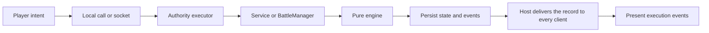

# Service architecture implementation plan

Status: planned. This document defines the implementation direction and the wave-by-wave workflow that builds it. Judgment calls and the run ledger go in [the todos file](plans/service-architecture.todos.md). The [architecture review](service-architecture-review.md) records the audit evidence and integration risks. The rules remain in [public/rules.html](../public/rules.html).

## Objective

Give the application a clear service structure that runs in the browser and inside a Foundry module. Preserve its rules, board, and interaction design while moving application behavior out of Svelte components.

Start with five functional services, one battle record, and one command execution path. Introduce each component when its workflow needs it. Keep the browser playable after every phase.

## Architecture decisions

1. Services own workflows. The engine owns rules. Views present state and submit intent.
2. One executor validates and commits shared changes. Services share its working state and return results; they do not maintain private copies of the battle.
3. One `BattleManager` coordinates lifecycle transitions that involve several services. Each transition produces one commit.
4. The browser and Foundry use the same services. Small adapters supply storage, transport, dice, and campaign access.
5. The primary GM executes shared commands in Foundry and performs every actor mutation. Other clients display authoritative results.
6. Each service starts as a module with explicit functions and dependencies. Add folders or classes when the implementation requires them. Keep command routing explicit; use a typed union and a small handler table or switch.
7. Foundry hosts the application in its own `ApplicationV2` window. The Svelte shell mounts there, and each board keeps its own `PIXI.Application` built against Foundry's PIXI global. The engine keeps its own grid; Foundry's hex API stays available from a window and the engine has no need of it.
8. The persisted record is the only state channel. The authority saves before it acknowledges, and the host delivers the saved record to every client. The socket carries command requests and replies.
9. The GM draws dice synchronously through `Die#randomFace()` and records each face. Chat rolls are built from the recorded faces after commit.
10. Players control the sides. By default the GM picks a side and every player takes the other; the GM can assign seats by hand as the edge case. A side's activations rotate through its seated players, and the turn holder picks any available unit. Seats and turns live in the session record and the executor's policy, outside the engine.
11. The app keeps its own notification host, `src/app/notifications.ts`, in the browser and in Foundry. Notices are local presentation: each client derives them from the records it adopts, and nothing about them enters the session or the socket. Foundry's `ui.notifications` serves one fallback, the turn notice for a player whose window is hidden.

## Service ownership

| Service | Owns | Initial source |
| --- | --- | --- |
| `MapPreparationService` | Board generation, terrain edits, construction, shared map appearance. | `BoardSetup.svelte`, `Paint.svelte`. |
| `ArmyPreparationService` | Roster selection, force generation, equipment, stable identities, placement, deployment validation, readiness. | `Place.svelte`, setup functions in `game.svelte.ts`. |
| `ActionResolutionService` | Unit selection, legal-action queries, movement/attack/spell execution, explicit pass/end operations, queries for acting side, activation, and round, and typed resolution events. | `takeAction`, `selectUnit`, `deselectUnit`, and `endActivation` in `game.svelte.ts`; action handling in `Battle.svelte`. |
| `BattleContinuationService` | Overnight declarations and recovery, day orders, surrender, next-board choice, next-day deployment, and next-day orchestration. | `BattleReport.svelte`, continuation functions in `game.svelte.ts`. |
| `OutcomeApplicationService` | Final outcome preparation, campaign handoff, conflict reporting, and resumption after interruption. | The [adapter contract](adapter-contract.md); implement alongside the campaign bridge. |

Keep existing pure engine functions behind these APIs. A spell, morale rule, or movement calculation remains a rule helper until it gains a distinct application workflow.

`ArmyPreparationService` supplies deployment validation for both initial setup and later days. `BattleContinuationService` collects each side's next-day placements and prepares the survivors and next battlefield; `BattleManager` combines those results with deployment validation before calling the engine's next-day transition.

An action can end an activation or round inside the engine. `ActionResolutionService` owns selection, resolution, and explicit end, so one module sees the complete transition and nothing advances an activation twice.

Map painting can invalidate deployments. `BattleManager` combines the terrain edit and the cleanup of unit and emplacement placements into one change. Undo restores all of it together.

## Supporting components

Keep these responsibilities in small modules beside their consumers:

| Component | Responsibility |
| --- | --- |
| Command executor | Validate, serialize, route, record history, and commit commands. |
| Session repository | Load, migrate, validate, and save the battle record as one serialized value. |
| Transport and reconciliation | Route requests and replies; adopt the delivered record by revision. |
| Interaction controller | Manage local targeting and the lifecycle of shared decision prompts. |
| Event presentation | Turn the last commit's events into board movement, effects, and log entries. |
| Chat adapter | Publish committed results through the GM, stamped with event IDs. |
| Notification host | The existing app-local service. A pure `noticesFor` function turns record changes into turn, activity, decision, command, authority, and storage notices for the viewer. |
| Campaign adapters | Build a battle request from PF2e or ReignMaker data and hand back the final outcome. |

Undo is an executor command, and its history lives in the authority's memory as it does today. Actor import is an adapter operation. Shared prompts belong to the workflow that requests them. These functions need clear APIs, but they do not need additional application services.

## Initial layout

```text
src/
  services/
    MapPreparationService.ts
    ArmyPreparationService.ts
    ActionResolutionService.ts
    BattleContinuationService.ts
    OutcomeApplicationService.ts    # add with campaign integration
    BattleManager.ts
  runtime/
    createRuntime.ts               # construct dependencies once
    session.ts                     # shared record and schema
    commands.ts                    # command/result types
    executeCommand.ts              # the commit boundary
    ports.ts                       # small host interfaces
  adapters/
    browser/                       # local storage and local execution
    foundry/                       # module entry, window, setting repository, socket, dice, chat
    pf2e/                          # add during campaign integration
    reignmaker/                    # add during campaign integration
  engine/                          # existing pure rules
  board/                           # existing PIXI renderer
  app/                             # views, read store, interaction/presentation helpers
```

Services import the engine and plain application types. They receive host operations through dependencies. Svelte, PIXI, and Foundry globals remain outside the services. Keep service-specific types and helpers beside their service; move a type into `runtime` only when the execution boundary shares it.

## State and execution

Wrap the existing `BattleState` in a versioned session. The initial record holds battle ID, schema/rules versions, revision, lifecycle stage, setup, battle state, the last commit's command ID and events, and a short list of recent command IDs. Add side control and the turn holder, source bindings, next-day placements, and outcome progress in the phases that use them.

Assign stable IDs when units and equipment enter setup. Preserve them through roster edits, deployment, subsequent days, and campaign export. Preserve existing battle IDs during save migration. Keep actor UUIDs and campaign IDs in source bindings outside the pure rules model.

Separate shared state from local view state. The active unit, terrain, deployment, actions, recovery declarations, and day orders are shared. Tabs, camera, hover, target previews, drag previews, and unfinished inputs are local. Existing setup tabs become navigation over the shared lifecycle stage.

All mutating UI operations use an awaitable command API. A command carries battle ID, command ID, and expected revision; a tactical command's action names its unit. Make `Acts.unit` required in the engine types. Clients supply intent; the authority determines permissions and results.



The executor reads current state inside its queue, validates the command, calls the service, and persists the result. The expected revision makes a resent command harmless, and the recent command IDs let the executor answer it with success. A rejection leaves state and undo history unchanged. Local previews can respond immediately while the authoritative command is pending.

## Workflow

The work runs as waves. One wave is one executor session with one gate and one review. A model with no memory of this design can run a wave from this file.

### Roles

| Role | Runs as | Duty |
| --- | --- | --- |
| Orchestrator | An Opus session | Reads this file, runs one wave at a time, calls the agents below, records the ledger in the todos file, and stops at every human gate. |
| Executor | `wave-executor`, with the wave's model passed as the `model` override | Builds exactly one wave and commits it. |
| Counter | `census` | Measures call sites before a wave whose scope depends on a count. |
| Sweeper | `recipe-sweeper` | Runs the mechanical sweeps the wave table names. |
| Gate | `test-verifier` | Runs the wave's gate after the executor reports and returns the decisive output. |
| Reviewer | `wave-reviewer`, at its configured model | Checks the wave's diff against the invariants. APPROVE opens the next wave; BLOCK returns the wave to an executor. |
| Mark | — | Plays each phase's human gate, rules on reserved judgment calls, and merges. |

### Executor reading list

1. This file: decisions, service ownership, layout, state and execution, invariants, and the wave being run.
2. `docs/plans/service-architecture.todos.md`, for the calls already made.
3. The review section the wave names in [the review](service-architecture-review.md). The review holds the evidence and the contracts; this file holds the work.
4. The source files the wave names, and the ReignMaker reference files it names under `/Users/mark/Documents/repos/pf2e-reignmaker`. Read ReignMaker for pattern only; copy no kingdom logic.

`public/rules.html` stays the arbiter of the rules. The other files in `docs/plans/` are history; leave them unread.

### Wave procedure

- Start each phase from a clean tree on the `service-architecture` branch. Another session's uncommitted work in `src/` stops the run until Mark clears it.
- Commit subjects start `Arch <wave>:`, for example `Arch 2.3: roster commands`. `git log --grep '^Arch '` is the progress record.
- The standard gate is `npx vitest run`, `npm run check`, and `npx vite build`. From Wave 0.2 it adds `npm run build:foundry`. Each wave adds its own greps under **Done**.
- A wave that edits `.svelte` files runs each touched component through the Svelte MCP `svelte-autofixer` before review.
- Every judgment call goes into the todos file as a dated one-line bullet. Shortcuts carry `// proto:`. A call this file reserves for review is flagged in the executor's report and left open.
- Tests follow `CLAUDE.md`. From Wave 1.1, `src/runtime` and `src/services` take direct tests for every invariant a wave names. Views and PIXI code stay under the prototype rules.
- The orchestrator stops at each human gate and reports. Mark plays the build, answers open calls, and merges the branch on his word. No wave opens a browser or Foundry on its own.

### Model assignment and escalation

Sonnet takes waves with one bounded module and a complete specification in front of it. Opus takes waves that set a contract later waves depend on, cross several layers, or change Svelte reactivity around asynchronous commands.

| Step | Trigger | Action |
| --- | --- | --- |
| Sonnet → Opus | One failed gate, or one BLOCK verdict | Rerun the wave on Opus. |
| Opus → Fable | Two failed gates, two BLOCK verdicts, or an executor report that a named contract cannot hold as written | Rerun the wave on Fable. |
| Fable → Mark | One failed gate or BLOCK on Fable | Stop the run and report. |

Hand the escalated model the wave text, the current diff, and the failing output or the verdict. Keep the rest of the run out of its context. Record each escalation in the todos file with its cause. Waves marked † set contracts that everything downstream trusts; escalate those on the first BLOCK.

| Wave | Model | Reason |
| --- | --- | --- |
| 0.1 | Sonnet, or `recipe-sweeper` | Six reads replaced by one function. |
| 0.2 | Opus | Build configuration, the PIXI alias, and the first `ApplicationV2` mount. |
| 1.1 † | Opus | The session schema and save migration; every later wave reads this record. |
| 1.2 † | Opus | The executor, its queue, and the commit boundary. |
| 1.3 | `census`, then `recipe-sweeper` | `Acts.unit` becomes required across the engine's callers and tests. |
| 1.4 | Opus | The first asynchronous commands under Svelte state. |
| 2.1 | Sonnet | Two small components behind one service, with the paint fix specified. |
| 2.2 † | Opus | Stable IDs touch the engine, setup, tokens, and saves. |
| 2.3 | Opus | `Place.svelte` is 517 lines of index-based selection. |
| 2.4 | Opus | Recovery, orders, surrender, and per-side next-day placement. |
| 2.5 | Opus | `BattleManager`, the last direct writes, and the read-store split. |
| 2.6 | Sonnet | The archive port over the existing serialized record. |
| 3.1 † | Opus | Typed events from a state comparison plus engine log tags, with the rules frozen. |
| 3.2 | Opus | `Battle.svelte` presentation moves from log prose to committed events. |
| 3.3 † | Opus | Revision policy, seats, rotation, and turn permissions. |
| 3.4 | Opus | The controllable transport and the multi-client proof. |
| 3.5 | Opus | Shared interaction records and their panels. |
| 3.6 | Sonnet | One pure function and one field on an existing service. |
| 3.7 | Sonnet | A dev page that shows two clients side by side. |
| 4.1 | Sonnet | A settings repository over a defined port. |
| 4.2 † | Opus | Socket transport, primary-GM routing, timeouts, and handoff. |
| 4.3 | Sonnet | The dice and chat adapters, both specified to the method. |
| 4.4 | Opus | World-user seating, presence, and the GM's setup controls. |
| 5.1 | Opus | The public `createBattle` API and its request validation. |
| 5.2 | Opus | The PF2e troop mapping and the morale normalization. |
| 5.3 | Mark | ReignMaker work, planned in that repository. |
| 5.4 | Opus | Outcome preparation from the adapter contract. |
| 5.5 † | Opus | Resumable, idempotent writeback. |

### Invariants

The reviewer checks each of these in every diff. A violation is a BLOCK.

1. The rules hold still. `public/rules.html` stays untouched. The engine suite passes with its assertions intact; Wave 1.3 adds `unit` to test actions and Wave 3.1 adds log tags, and neither changes an expected result.
2. The engine stays pure. `tsc --noEmit -p tsconfig.engine.json` passes, and `src/engine` imports nothing outside itself.
3. `src/services` and `src/runtime` import the engine and plain types only. `grep -rnE "svelte|pixi|foundry|localStorage|document\.|window\." src/services src/runtime` returns nothing.
4. Foundry globals appear in `src/adapters/foundry` alone.
5. From Wave 2.5, shared state changes inside `executeCommand` alone, and views call no persistence function.
6. The authority persists before it acknowledges. A rejected command changes neither state nor undo history.
7. The browser build plays after every wave, and a `battlefield.v4` save still loads.
8. The public exports of `src/board` keep their shapes, apart from the asset base in Wave 0.1.
9. Nothing on the deferred list under [scope control](#validation-and-scope-control) enters the code.

### Reserved for review

The executor flags these and leaves them open; Mark rules on them at the phase gate: the format of stable IDs, the shape of the save migration, the list of event types and log tags, the wording of any player-facing text for turns and seats, and every question that touches a rule.

## Phase 0: Foundry walking skeleton

Review sections: [Foundry host integration](service-architecture-review.md#foundry-host-integration) and the last row of the audit table. This phase changes no application architecture.

### Wave 0.1 — One asset base

- Add `src/board/asset-base.ts` with `setAssetBase(path)` and `assetUrl(relative)`. The default is `import.meta.env.BASE_URL`, so the browser needs no call.
- Replace the reads at `art.ts:11`, `paper.ts:26`, `ink-sheet.ts:20`, `terrain-sheet.ts:14`, `terrain-textures.ts:75`, and `layers/EffectLayer.ts:8`.
- **Done:** `grep -rn "BASE_URL" src/board` lists `asset-base.ts` alone. The standard gate passes.

### Wave 0.2 — Foundry build and window

- Add `module.json` for Foundry v14 with `socket: true`, and `vite.foundry.config.ts` in library mode: one ES module plus CSS into `dist-foundry/`, with the `terrainTextures` plugin shared from `vite.config.ts`. Add `npm run build:foundry`. Reference: ReignMaker's `vite.config.ts` and `module.json`.
- Alias `pixi.js` and `@pixi/core` to a shim that re-exports `globalThis.PIXI`. The two `@pixi/filter-*` packages bundle against the shim.
- Add `src/adapters/foundry/index.ts` and `BattlefieldApp.ts`: an `ApplicationV2` window that calls `setAssetBase('modules/<id>/')`, mounts `App.svelte` with Svelte's `mount`, and unmounts on close. Add a scene-control button or a macro-callable `api.open()`. Reference: `src/view/kingdom/KingdomApp.ts`.
- Scope the app's CSS under the window's root so Foundry's styles and the shell's leave each other intact. Reference: ReignMaker's `cssHash` prefix.
- Set `contain: layout` on the window's content root so the `position: fixed` rules in `AppShell`, `Notifications`, `TextureLab`, and `VfxGallery` resolve against the window. Give the app a root element, and have the `svelte:window` key handlers in `Battle.svelte` and `AppShell.svelte` and the ctrl-wheel listener in `main.ts` ignore events that start outside it.
- Copy `public/art` into the module output.
- **Done:** both builds pass. `grep -c "PixiJS" dist-foundry/*.js` returns 0, which shows the bundle carries no PIXI core; if the string proves a poor marker, replace this check with a better one and note it in the todos.

### Human gate 0

Mark links `dist-foundry` into `Data/modules`, enables the module in a v14 world with PF2e and ReignMaker active, and confirms: the window opens, art and textures load, the bevel and shadow filters render, the window resizes, a hot-seat day plays, and notifications appear inside the window, typing in Foundry's chat moves nothing on the board, and closing the window releases input and the WebGL context. The browser build still runs.

## Phase 1: One complete command path

Review sections: [Shared state and local state](service-architecture-review.md#shared-state-and-local-state) and [Command and synchronization contract](service-architecture-review.md#command-and-synchronization-contract).

Before Wave 1.1, the orchestrator proposes the `CLAUDE.md` amendment to Mark: the new directories in the layout section, and `src/runtime` and `src/services` exempt from prototype mode. It proceeds once Mark has made or approved the edit.

### Wave 1.1 † — Session record and browser repository

- Add `runtime/session.ts` with `BattleSession`, its schema version, and a validator. Start with battle ID, versions, revision, stage, setup, battle, `lastCommit`, and `recentCommandIds`.
- Add `runtime/ports.ts` with `SessionRepository { load, save }`. `save` rejects on failure.
- Add `adapters/browser/localRepository.ts`. It reads `battlefield.v4`, migrates it into a session (moving `intact` and `migrateMorale` out of `src/app`), writes the session under a new key as one JSON string, and keeps the old key until a migrated save has loaded once.
- **Tests:** a v4 save migrates with unit IDs and log intact; a corrupt save yields a fresh session; a failing store rejects.
- **Done:** `grep -rn "localStorage" src/app/game.svelte.ts` returns nothing.

### Wave 1.2 † — Executor, runtime, and action service

- Add `runtime/commands.ts` with the command and result types for `activation.select`, `activation.deselect`, `action.resolve`, and `activation.end`.
- Add `runtime/executeCommand.ts`: one promise queue; read current session; validate; call the service; bump the revision; `await repository.save`; then publish. Push undo history after a successful save. A thrown engine error becomes a rejection result that leaves session and history unchanged.
- Add `services/ActionResolutionService.ts` over `select`, `deselect`, `act`, and `endActivation`, with the dice port injected.
- Add `runtime/createRuntime.ts`, the one place that constructs dependencies.
- **Tests:** a rejected action changes neither revision nor history; two commands issued together run in order; a save failure rejects and leaves the published state at the last commit.

### Wave 1.3 — `Acts.unit` required

- `census` counts `act(` calls and action literals that omit `unit` across `src/` and `src/tests`.
- Make `unit` required in `Acts` (`engine/types.ts`), remove the `activeUnit` fallback from `act`, and have `TargetingService.resolve` and the maneuver and move callers name the unit.
- `recipe-sweeper` adds `unit` to each test action. Expected results stay as written.
- **Done:** `grep -n "unit?:" src/engine/types.ts` shows no match inside `Acts`. The engine suite passes with no assertion edits.

### Wave 1.4 — Commands under the store

- `game.svelte.ts` builds the runtime, exposes a read store that adopts published sessions, and turns `selectUnit`, `deselectUnit`, `takeAction`, and `endActivation` into awaitable wrappers over the command API. The other functions stay as temporary direct wrappers until Phase 2.
- `Battle.svelte` awaits the command before it reads results, and shows a rejection through the notification service under the ID `command`, replacing the `try`/`catch` notices in `commit` and `BattleReport.svelte`'s `attempt`. A failed save shows under the ID `storage` until a save succeeds.
- **Done:** a user loads a game, selects a unit, acts, ends the activation, reloads, and finds the result. Invalid actions change neither state nor history.

### Human gate 1

Mark plays a day in the browser and in the Foundry window, reloads mid-activation, and confirms an old save migrated.

## Phase 2: Complete workflow ownership

Review sections: [Service organization](service-architecture-review.md#service-organization), the P1 rows on direct writes and IDs, and the P2 paint row.

### Wave 2.1 — Map preparation

- Add `services/MapPreparationService.ts`: generate, reroll seed, edit spec fields, set rounds per day, and apply a paint stroke. Add the matching commands.
- A stroke clears units and emplacements that stand on water, in the same change as the terrain edit. Setup undo restores board and placements together; move the undo stack from `Paint.svelte` into the executor's history for the setup stage.
- `BoardSetup.svelte` and `Paint.svelte` submit commands and hold brush state alone.
- **Tests:** painting water under an emplacement unplaces it; undo restores terrain and both kinds of placement.

### Wave 2.2 † — Stable IDs

- Assign a unit ID and an equipment ID when a piece enters setup. `createBattle` uses the setup IDs in place of `u${i}`. Tokens for engines use equipment IDs in place of `engine:${i}` and `${u.id}:engine:${i}`.
- Setup selection and every setup command refer to pieces by ID. The save migration assigns IDs to old setups and keeps IDs already inside a running battle.
- The ID format is reserved for review; pick one, mark it `// proto:`, and flag it.
- **Tests:** removing the first roster entry leaves every other ID unchanged; a migrated battle keeps `u0…` IDs.

### Wave 2.3 — Army preparation

- Add `services/ArmyPreparationService.ts`: add and remove units and emplacements, attach equipment, place, unplace, auto-place, validate deployment with `canDeploy`, and report side readiness. Add the commands.
- `Place.svelte` submits commands; its local state keeps the selected piece and hover.
- **Done:** `grep -n "save()" src/app/Place.svelte` returns nothing.

### Wave 2.4 — Battle continuation

- Add `services/BattleContinuationService.ts` over `recoverAtNight`, `declareDayOrder`, `resolveDayOrders`, `answerSurrender`, the next-board choice, and `startNextDay`. Add `nextDeployment` to the session: each side's placements for the coming day, held until both sides are valid.
- `BattleReport.svelte` submits commands. Its recovery choices and placements become per-side submissions; its step navigation stays local.
- **Tests:** recovery runs once with both sides' choices; a new battlefield clears `nextDeployment`; `startNextDay` refuses an invalid side.

### Wave 2.5 — BattleManager and the last direct writes

- Add `services/BattleManager.ts` for start, return to setup, reset, continuation, and finalization. Each transition is one commit.
- Undo becomes a command over the executor's in-memory history, with the boundaries `game.svelte.ts` keeps today: a committed night, a new day, and resolved orders clear it.
- Split `game.svelte.ts` into the read store and a local navigation store for tabs and steps. Remove the `save` export.
- **Done:** `grep -rnE "game\.(setup|battle|stage)[A-Za-z0-9_.\[\]!?]*\s*=[^=]" src/app --include='*.svelte'` returns nothing, and no view imports `save`. Invariant 5 holds from here.

### Wave 2.6 — Battle archive

- Add `BattleArchive { list, save, load, remove, export, import }` to `runtime/ports.ts`, a local-storage implementation, and a `session.load` command. Loading migrates the save, installs it at the next revision, and clears interactions, history, and `recentCommandIds`.
- Add a small save and load panel to the top bar.
- **Tests:** a loaded session takes the next revision; loading an older schema migrates it.

### Human gate 2

Mark plays setup, a battle, dusk, recovery, a surrender or withdrawal, and a second day, then saves and loads a battle, in the browser and in the Foundry window.

## Phase 3: Execution events and the synchronization proof

Review sections: [Dice, events, and interactions](service-architecture-review.md#dice-events-and-interactions), [Side control and turn rotation](service-architecture-review.md#side-control-and-turn-rotation), and the command path steps.

### Wave 3.1 † — Typed events and recorded dice

- Define `BattleEvent` in `runtime`: `unitMoved`, `checkResolved`, `freeStrikeResolved`, `woundsChanged`, `disorderChanged`, `unitRouted`, `spellResolved`, `activationEnded`, `roundEnded`, `battleEnded`. Each carries `${commandId}:${index}` as its ID.
- `ActionResolutionService` derives movement, wounds, disorder, routs, and activation and round ends by comparing state across the transition. The route comes from `movePath` on the prior state. An `advance` yields its move, then its melee events, in one commit; take both paths from the `MeleePlan` that matches the action.
- Add an optional `tag` to `LogEntry` and set it at the free-strike sites, the spell resolution sites, and the secondary die at the `const second =` draw. Leave every other `log(` call alone. `LogEntry.check` supplies ordinary checks.
- Wrap the dice port so each transition records its faces in order; store them on `lastCommit`.
- The event list and tag names are reserved for review. No expected result in the engine suite changes.
- **Tests:** a maneuver that draws a free strike yields one `freeStrikeResolved`; a Sure Strike records two faces; a move yields its route.

### Wave 3.2 — Event presentation

- Add `app/presentation.ts`: it plays `lastCommit.events` when the revision advances by one and stays silent on a larger jump.
- `Battle.svelte` drops `FREE_STRIKE_RE` and the post-command log reads in `performActivity` and `performManeuver`. Flashes, bursts, arrows, and markers come from events.
- **Done:** `grep -n "FREE_STRIKE_RE" src/app/Battle.svelte` returns nothing.

### Wave 3.3 † — Revisions, seats, and turns

- The executor enforces `expectedRevision` and answers a command ID found in `recentCommandIds` with success. Keep the last twenty IDs.
- Add `runtime/control.ts` as pure functions: `SideControl` with `auto` and `manual` modes, the turn holder named in the commit that makes a side pending, the per-side pointer that runs on across rounds and days, and the skip over users a presence port reports offline. A side with nobody online falls to the GM.
- Add `runtime/policy.ts`: tactical commands from the turn holder, side-level decisions from any user seated on that side, every command from a GM. Add `control.assign` and `turn.reassign`. Undo snapshots include `turn` and `control.next`. The hot-seat policy seats one local user on both sides and marks that user as GM.
- **Tests:** a resent command commits once; a stale revision is rejected with the current revision; three seats with two units rotate A, B, C, A; an offline seat is skipped; a player outside the turn is refused; undo restores the turn holder.

### Wave 3.4 — Controllable transport and the multi-client proof

- Add a transport port with `request` and `onRecord`, and an in-memory implementation for tests that can delay, duplicate, reorder, and drop deliveries.
- Add `runtime/reconcile.ts`: adopt a newer revision, ignore an older or equal one.
- **Tests:** three client stores and one authority converge under each fault; a delayed action cannot reach a different unit or activation; a joining client adopts state and presents nothing.

### Wave 3.5 — Shared interactions

- Add `InteractionRecord` to the session for side readiness, recovery declarations, surrender responses, and next-day deployment. A stage change clears obsolete records in the same commit.
- Panels derive from the records and the viewer's seat. Every client shows the turn holder; tactical controls are live for that user alone. A local scope disposes timers, overlays, and pending promises on close. Reference: ReignMaker's `BroadcastObserver.svelte` and `PhaseScope.ts`.

### Wave 3.6 — Session notices

Review section: [Notifications](service-architecture-review.md#notifications).

- Add an optional `expiresInMs` to `Notification`; the service clears an expiring notice on its timer and cancels the timer on replacement, dismissal, and `clear`.
- Add `app/session-notices.ts` with the pure `noticesFor(previous, next, viewer)`. It returns notices to show and IDs to dismiss for the `turn`, `activity`, `decision`, and `command` kinds in the review's table. The `activity` line comes from `lastCommit.events` and appears for commits by other users alone.
- The presentation module calls it on every adopted record. A joining client gets the `turn` notice and no `activity` backlog.
- The wording is reserved for review; write plain first drafts and flag them.
- **Tests:** the holder reads "Your turn" and another viewer reads the holder's name; a viewer's own commit raises no `activity` notice; a revision jump raises none; a closed interaction dismisses its `decision` notice.

### Wave 3.7 — Two-client dev page

- Add `dev/two-clients/`: two app instances with different user IDs over the in-memory transport and one authority, side by side, with controls for delay and drop.

### Human gate 3

Mark plays the two-client page: both boards show the same action, the turn passes between seats, each board's notices name its own viewer's part in the turn, and a dropped delivery recovers. He rules on the reserved event list and ID format. The service refactor is complete here.

## Phase 4: Foundry authority

Review sections: [Command and synchronization contract](service-architecture-review.md#command-and-synchronization-contract), [Persistence and actor ownership](service-architecture-review.md#persistence-and-actor-ownership), and the ReignMaker lessons paragraph. `src/adapters/foundry` declares the few Foundry types it touches in a local `.d.ts`.

### Wave 4.1 — Setting repository and archive

- Register two world-scoped settings with `config: false`: the session string and the archive, capped at ten slots. Implement `SessionRepository` and `BattleArchive` over them, with file export and import through Foundry's `saveDataToFile`.
- Feed the session setting's `onChange` into `reconcile` on every client, the writer included.

### Wave 4.2 † — Socket transport and the primary GM

- Implement the transport over `game.socket` on `module.<id>`: request, result, and error envelopes with a protocol version; a ten-second timeout that leaves the result unknown; an envelope guard that drops foreign traffic; and a readiness gate that holds requests until the runtime is built. Reference: `src/services/ActionDispatcher.ts`.
- Only the client where `game.users.activeGM` is the current user executes. A secondary GM sends requests like a player. With no active GM, clients read and the UI disables commands.
- On timeout, the client waits for the next record or resends the same command ID. Check primary status immediately before `save`. On `activeGM` change, the new primary loads the committed session and starts with empty history.
- Raise the `authority` notice while no primary GM is active, during a handoff, and after a reply timeout; dismiss it when authority returns.
- Requester identity comes from the envelope and is checked against active users and the policy; the review records the limits of that check.
- **Tests:** with a fake socket, a secondary GM's command reaches the primary and runs once; a lost reply followed by a resend commits once.

### Wave 4.3 — Dice and chat adapters

- The dice port draws with `new foundry.dice.terms.Die({ faces: 20 }).randomFace()`.
- After commit, the primary GM builds one `Roll` per `checkResolved` event from a `Die` term carrying the recorded result, posts it through one chat service, and stamps the event ID in a message flag. A chat failure is caught and logged. Reference: `src/services/chat/kingdomChatService.ts`.

### Wave 4.4 — World seating and GM controls

- The presence port reads `game.users`. In `auto` mode the primary GM rebuilds the player side when the world's users change. Add the GM's side picker and the manual seat editor to setup. Undo and load are GM-only.
- When the app window is closed or minimized, send the `turn` notice for the local user through one `ui.notifications.info` call. This is the module's only use of Foundry's notifications.

### Human gate 4

One GM and two players complete a battle, each in their own window and on any scene. Every player sees movement, effects, results, the turn holder, and their own turn notice, including with the window minimized. A reload restores the session. A second GM cannot run a command on their own client. Player clients write no documents.

## Phase 5: Campaign import and outcome application

Review section: [Persistence and actor ownership](service-architecture-review.md#persistence-and-actor-ownership), and [the adapter contract](adapter-contract.md), which rules on every mapping.

### Wave 5.1 — `createBattle` API

- Expose `game.modules.get('<id>').api.createBattle(request)` and `api.open()`. The request carries unit cards, sides, source bindings with import baselines, equipment, and a `BoardSpec`. Validate it and start a session in setup. Battlefield reads no ReignMaker flags.

### Wave 5.2 — PF2e troop adapter

- Build a `UnitCard` from a PF2e troop actor as the adapter contract's table describes, using `scripts/import-troops.mjs` as the reference mapping. Remove Demoralized from prepared stats and pass it as `disorder`.

### Wave 5.3 — ReignMaker API

Work in the ReignMaker repository, with its own plan: build the battle request from army and hex data, and expose `applyBattleOutcome(outcome, operationId)`, idempotent on the operation ID and run under `withActorWriteLock`. The run stops here until Mark reports it done.

### Wave 5.4 — Outcome preparation

- `OutcomeApplicationService.prepareOutcome` is a pure function from a final session to a before/after report: hit points from wounds, disorder replacing Demoralized, Routed at 3, `left` and `destroyed` statuses, captured and abandoned equipment including `previousBattlefields`, wall damage, and the loser's fallback. It refuses a dusk ending that can continue.
- **Tests:** one per mapping line in the adapter contract.

### Wave 5.5 † — Resumable writeback

- `applyOutcome` takes the GM-confirmed outcome. The operation ID derives from the battle ID. With ReignMaker active it calls `applyBattleOutcome`; otherwise the PF2e adapter writes hit points and conditions as absolute values, one target at a time, with per-target progress in the session.
- A target whose current values differ from the import baseline and from the desired values raises a conflict for the GM. An interrupted run resumes at the first unfinished target. Writeback closes undo and blocks loading; the stage reaches `finalized` after the last target.
- **Tests:** an interrupted run resumes without repeating a finished target; a second run with the same operation ID writes nothing; an outside edit raises a conflict.

### Human gate 5

A battle imports real campaign units and applies its final outcome once. An interrupted writeback resumes. A later battle day writes no intermediate outcome.

## Validation and scope control

Keep the existing engine suite as the rules baseline. Every wave runs the standard gate, and Mark inspects the affected UI at each human gate. From Phase 1, test the executor, repository, and reconciliation code directly: state/undo consistency, command ordering, duplicate handling, and recovery from interrupted writes. Views and PIXI code stay under the prototype rules until the `CLAUDE.md` section goes.

Further service extraction requires a coherent workflow with independent inputs, outcomes, and dependencies. Keep snapshot synchronization, direct dependency injection, and explicit command routing until measured problems justify more machinery. Defer generic event buses, plugin registries, full event sourcing, optimistic mechanical updates, deferred persistence, stored command results, and chat delivery records.

The foundation is complete when the application runs in a Foundry window, every shared change passes through one executor, and two clients can observe the same authoritative execution. Foundry authority and the campaign bridge then attach around that structure.
