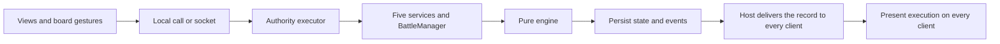

# Battlefield service architecture review

Date: 2026-09-17, verified and revised 2026-09-18. Status: audit and design reference; runtime code remains unchanged.

The [implementation plan](service-architecture-plan.md) defines the five-service structure and phased work. Use that plan for implementation; this review supplies evidence and integration detail.

Review baseline: Battlefield `dd581d7`, the local ReignMaker checkout at `d1e7178bf`, and the Foundry 14.365 core source installed on this machine. This review covers application state, rules execution, board integration, persistence, and ReignMaker's command, synchronization, interaction, and chat paths. Foundry v14 is the initial target, matching ReignMaker's manifest (`compatibility` 14/14/14). Claims about Foundry's dice, grid, and bundled PIXI come from reading that source. Live Foundry integration remains to be tested.

Line references stay pinned to `dd581d7`. The working tree has since gained an `advance` action that commits a move and a melee as one decision (`AdvanceAction`, `meleePlans`, `dragBlockReason`), an app-local notification service (`src/app/notifications.ts`), and a reordered `takeAction` that calls `act` before it records history.

## Recommendation

Organize the application around self-contained services with a small `BattleManager` that coordinates the battle lifecycle. Name each service for the function it performs: `ActionResolutionService`, `ArmyPreparationService`, or `OutcomeApplicationService`. Preserve the pure rules engine and the PIXI board. Each service owns its commands, validation, queries, and operation results. A single command executor owns commits to the shared battle record.

Run these same services in the browser prototype first. Supply local persistence and transport through interfaces. Later, supply Foundry implementations that route commands to the primary GM, persist shared state, and synchronize clients. This gives the prototype the intended architecture before the migration.

Host the application in its own Foundry window. An `ApplicationV2` mounts the existing Svelte shell, and the board keeps its own `PIXI.Application` built against Foundry's PIXI global. The [host section](#foundry-host-integration) records the reasons.

These services are modules within one application. They share one transactional battle record; they do not each maintain a competing copy of it. Use constructor or factory injection from one composition root rather than global service singletons.

## Audit findings

Priority here means migration priority. The current hot-seat prototype deliberately assumes one user and one browser.

| Priority | Finding and evidence | Consequence and proposed response |
| --- | --- | --- |
| P1 | UI components write shared state directly. `Place.svelte:91` adds and removes roster entries and changes placements; `Paint.svelte:38` applies strokes; `BoardSetup.svelte:15` changes setup fields. | Wrapping `takeAction` in a socket would leave setup and deployment outside the authority boundary. Route every shared mutation through a service command. |
| P1 | `game.svelte.ts:48` combines save loading, migrations, Svelte state, rules execution, navigation, and undo. `takeAction` at line 152 rolls and replaces state immediately. | The store cannot serve as both a player replica and an authority. Separate the command executor, repository, read store, and local view state. |
| P1 | `BattleState` at `engine/types.ts:251` has game state but no session identity, revision, or controller assignments. `Acts.unit` at line 113 is optional, and `activeUnit()` falls back to the first activatable unit. | A delayed action can resolve against the unit that is active when it arrives. Require explicit unit identity and expected revision on tactical commands; validate them on the GM. |
| P1 | `createBattle` at `engine/battle.ts:47` assigns `u${i}` IDs. Setup identifies pieces by array index; equipment uses names or array positions. | Roster edits and campaign handoff lack stable references. Assign unit and equipment IDs when they enter setup, preserve them through battle, and keep a separate source-binding table. Existing battle IDs already survive day continuation. |
| P1 | `performActivity` at `Battle.svelte:861` reads the log immediately after `takeAction`, identifies free strikes from prose (`FREE_STRIKE_RE`), and plays effects on the initiating client. `performManeuver` repeats the pattern. The engine records outcomes through 94 `log(state, …)` calls in `battle.ts`; for most outcomes the prose is the only record. | Remote clients lack equivalent feedback, and an asynchronous rejection would invalidate the local animation. Produce typed resolution events, then render them after commit on every client. Size the work: tag the log sites that need structure and derive the remaining events from a state comparison. |
| P1 | `Rng.d20()` is synchronous (`engine/rng.ts:1`); the app supplies `Math.random`. | The GM must own mechanical rolls. Foundry's `Roll.evaluate()` is asynchronous and `evaluateSync` refuses dice, but `Die#randomFace()` draws synchronously. A GM adapter draws through it and retains each face for the chat record. |
| P1 | The campaign adapter exists as a contract in `docs/adapter-contract.md`, rather than as an import/writeback implementation. ReignMaker's `module.api` exposes sixteen functions, none for armies, equipment, or actor writes. | Actor identity, normalized morale, equipment ownership, and resumable outcome application need service contracts before actor updates begin. ReignMaker needs a new API before Battlefield can hand it an outcome. |
| P2 | `save()` silently catches failures (`game.svelte.ts:73`); save validation checks a few fields and migrations live in the app. | A multiplayer command must distinguish a durable commit from a failed save. Add schema versions, validation, explicit migration, and visible persistence errors. |
| P2 | `takeAction` adds history before the engine accepts the action (`game.svelte.ts:154`), and `act` throws on an illegal action; `undo` restores a local snapshot. | A rejected action leaves a redundant history entry. The working tree already reorders `takeAction` to fix this; the executor keeps the rule. Commit history only after success. Multiplayer undo must create a new authoritative revision. |
| P2 | A paint stroke clears unit placements on water (`Paint.svelte:45`) and leaves emplacements where they stand; `generate()` clears both (`game.svelte.ts:80`). Paint undo restores only the board (`Paint.svelte:55`). | Terrain undo leaves the deployments changed. An emplacement left on water makes `createBattle` throw, and `startBattle` has no handler. Clear both kinds of piece, and store and restore the full setup change as one operation. These are existing hot-seat defects. |
| P2 | `battle.ts` has 1,854 lines; `Battle.svelte` has 1,585. | Rules execution and interaction handling concentrate many responsibilities. Extract the application services first; split pure rule helpers and UI interaction models as their boundaries become clear. |
| P2 | Six board files build art URLs from Vite's `BASE_URL`: `art.ts:11`, `paper.ts:26`, `ink-sheet.ts:20`, `terrain-sheet.ts:14`, `terrain-textures.ts:75`, and `layers/EffectLayer.ts:8`. The build sets `base: './'`, which resolves against `/game` inside Foundry. Twenty-nine board files import `pixi.js`, and the two `@pixi/filter-*` packages peer-depend on `@pixi/core`; Foundry ships neither filter. | Every art request fails inside Foundry until the host supplies the base path. A Foundry build that bundles its own PIXI core produces filters the host renderer cannot use. Inject one asset base, and alias `pixi.js` and `@pixi/core` to the host global. |

The strongest existing foundations are the DOM-free engine compilation, explicit `Action` types, engine-side legality checks, injected randomness, and `mountBoardView`. `TargetingService` also provides a useful boundary between a board gesture and an engine action. The `virtual:terrain-textures` module resolves at build time and works in any Vite build. Keep these.

## ReignMaker reference patterns

The current source takes precedence over older architecture documents. In particular, the current action stream defaults to enabled in `src/index.ts:529`.

| ReignMaker source | Pattern to adopt | Battlefield adaptation |
| --- | --- | --- |
| `src/controllers/TurnManager.ts` | A coordinator owns lifecycle transitions. | `BattleManager` coordinates setup, battle, overnight recovery, continuation, and finalization. Engine functions retain rule authority. |
| `src/services/ActionDispatcher.ts` | Typed requests, correlated results/errors with a ten-second timeout, a startup readiness gate, an envelope guard against foreign socket traffic, and separate broadcast handlers. | One transport endpoint carrying command requests and their replies. |
| `src/services/commands/commandRegistry.ts` and `src/services/kingdom/handlers.ts:258` | Clients send command names and arguments; the GM evaluates them against fresh state. | A small closed command union suffices initially. Tactical commands also carry revision preconditions because a legal action can become inappropriate after another action. |
| `src/actors/actorWriteQueue.ts` | Serialize read–validate–write operations for each document through one promise chain per actor. | One queue for the battle record. ReignMaker's lock is internal to its bundle, so campaign writes to ReignMaker data go through a ReignMaker API that holds that lock. |
| `src/stores/turnState/reconcile.ts` | Reconcile authoritative state by monotonic version and reject stale arrivals. | Full snapshots and monotonic revisions. Introduce patch replay only after measurement warrants it. |
| `src/services/army/ArmyDeploymentBroadcastService.ts`, `MoraleBroadcastService.ts`, and `src/view/kingdom/BroadcastObserver.svelte` | Persisted interaction state (`activeBroadcast` in the `turn-state` flag) drives initiator and observer panels. | Persist decision workflows; derive each user's controls from their role and the interaction record. Keep ordinary hover and targeting local. |
| `src/controllers/turn/PhaseScope.ts` | A disposable registry closes interactions and releases UI resources when services register against the current scope. | Scope by battle, stage, day, and activation identity. Every client disposes its own view resources. The authority clears shared interactions in the transition commit. |
| `src/services/chat/kingdomChatService.ts` | Centralize chat creation; catch and log chat failures so they never invalidate game state. | One GM chat publisher consumes committed battle events and attaches the recorded rolls. |
| `src/view/kingdom/KingdomApp.ts` | An `ApplicationV2` window mounts a Svelte 5 application. | The same host for the Battlefield shell. |

Five details deserve deliberate changes.

- ReignMaker's socket receive path checks the primary GM, but its local dispatch shortcut at `ActionDispatcher.ts:272` checks `isGM`. Battlefield routes secondary GMs through the primary too.
- Its common sender check confirms an active user from a sender ID the client asserts. Battlefield also needs command-specific control and stage checks.
- Its action stream broadcasts before the next checkpoint, with a documented crash-loss window and a five-second maximum checkpoint interval (`actionStream/checkpointWriter.ts`). Battlefield persists each accepted command before acknowledging it. That choice removes the need for a separate state broadcast.
- `TurnManager` is a singleton with a private constructor and static imports of module singletons. A comment there records that barrel imports pulling Svelte panels into the graph broke its Node tests. Battlefield injects dependencies from one composition root.
- ReignMaker players roll PF2e checks on their own clients, and the GM applies commands derived from the outcome. A Battlefield transition consumes dice whose count depends on earlier results, so the GM rolls inside the transition.

ReignMaker's source also records four lessons that apply here. Deleting a flag key in v14 requires a `new ForcedDeletion()` instance (`utils/flag-deletion-diff.ts`). On a player client, `actor.update` resolves before the local `_source` updates, which is the reason `waitForFlagVersion` exists. The actor write lock is non-reentrant, and a holder that awaits a nested acquisition deadlocks. Foundry replays buffered socket events before `ready`, which is the reason for the readiness gate.

## Service organization

The implementation uses five services. The [plan](service-architecture-plan.md#service-ownership) specifies their extraction sequence and completion criteria.

| Service | Responsibilities | Existing source to place behind its API |
| --- | --- | --- |
| `MapPreparationService` | Board generation, terrain edits, construction, and shared map appearance. | `BoardSetup.svelte`, `Paint.svelte`, `engine/board.ts`. |
| `ArmyPreparationService` | Roster composition, equipment, stable identities, placement, deployment validation, and readiness. | `Place.svelte`, `engine/force.ts`, deployment helpers. |
| `ActionResolutionService` | Acting-unit selection, legal-action queries, movement, attacks, spells, explicit pass/end operations, and typed execution events. | `takeAction`, `selectUnit`, `endActivation`, action handling in `Battle.svelte`, `engine/battle.ts`. |
| `BattleContinuationService` | Overnight recovery, day orders, surrender, next-board choice, next-day deployment, and next-day orchestration. | `BattleReport.svelte`, `engine/aftermath.ts`. |
| `OutcomeApplicationService` | Final campaign outcome preparation, application, conflict handling, and resumption. | `docs/adapter-contract.md`; future campaign adapters. |

Selection and activation end stay inside `ActionResolutionService`. They wrap three short engine functions and share state, inputs, and dependencies with action resolution. One owner removes the hazard of advancing an activation twice.

`BattleManager` coordinates transitions that involve several services. The executor commits their combined result once. For example, map painting and deployment invalidation form one undoable operation.

Start each service as a small module. Keep its types and helpers beside its public functions. Preserve the existing pure engine and PIXI board. Add supporting modules for execution, persistence, transport, reconciliation, interaction controllers, event presentation, and host adapters as needed.

Undo belongs to the executor's history mechanism. The history lives in the authority's memory, as it does today: `save()` omits it and a reload clears it. Actor import belongs to the campaign adapters. The workflow that requests a shared decision owns its meaning; a reusable interaction controller manages its UI lifecycle. Event presentation consumes committed results on each client, while the GM chat adapter posts them. These components have explicit APIs without additional application services.



## Shared state and local state

Wrap `BattleState` in a session record. Keep network metadata outside the rules model.

```ts
interface BattleSession {
  schemaVersion: number;
  rulesVersion: string;
  battleId: string;
  revision: number;
  stage: 'setup' | 'deployment' | 'battle' | 'aftermath' | 'finalized';
  setup: BattleSetupDraft;
  battle: BattleState | null;
  nextDeployment: Partial<Record<Side, Record<string, string>>>;
  control: SideControl;
  turn: { side: Side; userId: string } | null;
  sources: SourceBinding[];
  interactions: InteractionRecord[];
  lastCommit: { commandId: string; events: BattleEvent[] } | null;
  recentCommandIds: string[];
  outcome: CampaignOutcomeRecord | null;
}
```

These are proposed types, not existing exports. A `SourceBinding` links a stable unit or equipment ID to actor UUID, optional token UUID for synthetic actors, ReignMaker army/equipment ID, and the import baseline. Never identify campaign objects by display name. `nextDeployment` holds each side's placements for the coming day until `startNextDay` consumes them; `BattleReport.svelte` keeps both sides' positions in one component today.

Shared state includes the active unit, spent actions, committed placement, readiness, terrain, rolls, night declarations, and day decisions. Current `select()` changes the shared active unit; it must remain an authority command. Inspecting an arbitrary unit can use a separate local selection.

Local state includes open tabs, pointer position, hover, candidate targets, drag previews, camera position, zoom, and unfinished form inputs. The current `Stage` mixes navigation with lifecycle. Setup tabs should remain local while shared stage permissions govern editing. GM-authored map appearance belongs in shared presentation settings; personal zoom and accessibility preferences remain local.

## Side control and turn rotation

Players control the two sides. The engine knows sides and units only; users, seats, and turns live in the session record and the executor's policy.

```ts
interface SideControl {
  mode: 'auto' | 'manual';
  gmSide: Side;                     // auto: the GM plays this side, every player the other
  seats: Record<Side, string[]>;    // user IDs in turn order
  next: Record<Side, number>;       // rotation pointer into seats
}
```

In `auto` mode, the default, the GM picks a side during setup and every player in the world takes the other. The authority fills `seats` from the world's users and rebuilds the player side when that roster changes. In `manual` mode the GM assigns and orders users on each side through a `control.assign` command. Manual mode is the edge case and shares every other rule.

A side's activations rotate through its seats. When the engine makes a side pending, the executor names the turn holder in the same commit: the seat at `next[side]`, skipping users who are offline, and it advances the pointer. The turn holder selects any activatable unit of their side, which may differ from the unit they moved last time, and acts until that activation ends. The pointer runs on across rounds and days, so three players sharing two armies each act equally often over time. A side with no player online falls to the GM.

The executor accepts `activation.select`, `action.resolve`, and `activation.end` from the turn holder. A GM may issue any command for either side, which covers a player who disconnects mid-activation, and a `turn.reassign` command hands the open turn to another seat. The expected revision already rejects a command built against an earlier turn. Side-level decisions, which are placement, readiness, recovery declarations, day orders, and surrender responses, accept any user seated on that side; the last submission before the side confirms stands.

`turn` and `control.next` change with the tactical state, so undo snapshots cover them alongside `BattleState`. A loaded save drops seat IDs the world no longer has, and `auto` mode rebuilds its seats. The browser hot-seat policy seats one local user on both sides.

Every client shows the turn holder's name. The holder's client enables the tactical controls; every other client observes the same board and events.

The initial proposal assumes players can see the shared battle state. Hidden deployment or secret orders would require separate private storage and recipient-specific projections.

## Command and synchronization contract

Use Foundry's native module socket for requests and replies, as ReignMaker does. A module requests its namespace with `socket: true`; the server relays messages to other clients. Foundry also exposes `game.users.activeGM` for selecting one active GM. These are platform mechanisms; the command protocol below is application behavior. [Module sockets](https://foundryvtt.com/article/module-development/), [active GM API](https://foundryvtt.com/api/classes/foundry.documents.collections.Users.html#activeGM).

```ts
type CommandRequest = {
  protocolVersion: 1;
  kind: 'command';
  requestId: string;            // correlation for this transmission
  commandId: string;            // stable across retries
  battleId: string;
  expectedRevision: number;
  command: BattleCommand;
};

type BattleCommand =
  | { type: 'activation.select'; unitId: string }
  | { type: 'action.resolve'; action: Action }
  | { type: 'activation.end'; unitId: string }
  | { type: 'recovery.declare'; choices: RecoveryChoice[] }
  | { type: 'dayOrder.choose'; order: DayOrder }
  | { type: 'nextDay.place'; positions: Record<string, string> }
  | { type: 'control.assign'; control: Pick<SideControl, 'mode' | 'gmSide' | 'seats'> }
  | { type: 'turn.reassign'; userId: string };
```

The union illustrates the contract; setup, interaction, undo, and campaign commands complete it. Make `Acts.unit` required in the engine types so an action names its unit once. Derive side permissions from the requester and session, rather than accepting a client claim.

The command path is:

1. The client builds a command from its visible revision. It marks the operation pending while keeping committed state intact.
2. The primary GM validates the envelope, supported schema/rules version, payload shape, requester, and command type. A secondary GM uses this same route. A missing GM leaves the battle readable and disables mutations.
3. The executor enters the battle queue and reads current state. A command ID already in `recentCommandIds` returns success with the current revision. Every other command must match `expectedRevision`.
4. The executor checks the requester against the turn holder or the side's seats, then stage, explicit active unit, and engine legality. A stale request returns current revision information so the client can refresh and ask the user to confirm a new action. It never silently applies a stale choice to a new activation.
5. The responsible service resolves the operation using authoritative dice. The executor persists next state, revision, `lastCommit`, and the command ID in one write.
6. After persistence succeeds, the GM replies to the requester with the command ID and new revision. Foundry delivers the persisted record to every client, the requester included. That delivery is the only state channel.
7. Clients adopt newer revisions and ignore older ones. A client that advances by exactly one revision presents the events in `lastCommit`. A client that joins or skips revisions adopts the state and presents nothing.

Every command carries `expectedRevision`, so a resent command cannot apply twice: its revision has passed. `recentCommandIds` holds the last twenty or so IDs and turns that stale rejection into a success for a client whose reply was lost. A timeout means the result is unknown: wait for the next record delivery or resend the same command ID. It does not authorize a new roll.

Treat undo as a GM-only command in Foundry. Restore the chosen game snapshot from the authority's in-memory history under a new revision, invalidate current interactions, and record the reversal. Keep the previous rolls in the chat log. Close ordinary battle undo when campaign writeback starts; reversing campaign effects requires a separate operation. The browser hot-seat policy can grant its local user the same authority.

On connection or reload, load the durable record and adopt it. On GM change, pause commands, load committed state on the new primary, and then resume; undo history starts empty there. A command in flight on the old GM either committed, and every client sees its revision, or left no trace, and the requester resends it. Check primary authority immediately before persistence. A local queue is not a distributed lock; two clients that each believe they are primary during a handoff remain an integration test. Do not claim exactly-once transport or atomic compare-and-swap from these client APIs.

ReignMaker's sender ID is part of the client envelope. An active-user lookup is useful validation, but it does not establish cryptographic sender identity. Use command allowlists, GM-side permissions, and document access controls; verify sender metadata in the target runtime before promising stronger authentication. The initial model assumes a cooperative Foundry table.

## Persistence and actor ownership

Store the session as one serialized JSON string in a world-scoped module setting. Only a GM can write a world setting, every client receives the change through `onChange`, and a string value replaces atomically. This avoids recursive-merge deletion handling, document ownership management, and sidebar clutter. The initial limit is one active battle per world. The ReignMaker campaign record stores the battle ID.

The repository interface permits a later change without altering services. A dedicated JournalEntry per battle, holding the same serialized string in a module flag, becomes the better store once several concurrent battles or per-battle exports matter. Keep the value serialized there too.

Saved battles use the same serialized value. A small archive port offers list, save, load, delete, export, and import. Saving copies the active string into a slot with a name, a timestamp, and the day and round; it changes no shared state and needs no command. Loading is a GM-only command: it migrates the saved session, installs it at the current revision plus one, and clears interactions, undo history, and recent command IDs. Clients see a revision jump and adopt the state without presenting events. The browser keeps slots in local storage. Foundry keeps up to ten in a second world setting, which changes only on save, and offers file export and import beyond that, as ReignMaker does for kingdoms.

A loaded save from before finalization must never apply its campaign outcome twice. Derive the outcome operation ID from the battle ID, so the idempotent host API refuses a second application, and block loading while writeback is in progress.

All troop actor changes run on the primary GM. Import actor values into a battle snapshot; use that snapshot throughout play. Apply campaign consequences at finalization rather than rewriting actor HP after each tactical action. This follows the current adapter contract and keeps battle undo tractable.

The campaign seam is two module APIs. Battlefield exposes `api.createBattle(request)`: the caller supplies unit cards, sides, source bindings, and a `BoardSpec`, so Battlefield never reads ReignMaker's flag schema. ReignMaker exposes `applyBattleOutcome(outcome, operationId)`, idempotent on the operation ID, and runs it under its own actor write lock. Two modules writing the same actor from separate queues recreate the clobber recorded as finding F1 in ReignMaker's `actorWriteQueue.ts` header. Without ReignMaker, a PF2e adapter in Battlefield writes hit points and conditions on troop actors directly.

The campaign outcome includes wounds/HP, final disorder, Routed status, permanent losses, equipment capture or abandonment, fortification damage, and withdrawal consequences. Include `previousBattlefields` when accounting for equipment and damage. A dusk report can continue into another day, so `phase === 'ended'` alone is insufficient to authorize campaign finalization.

`OutcomeApplicationService.prepareOutcome` builds a concrete before/after report. Its `applyOutcome` method accepts only the chosen final outcome revision, then hands the outcome to the host adapter. ReignMaker retains ownership of kingdom turns, leader actions, disbanding rules, and campaign movement. The import side normalizes Demoralized; the export side replaces its final value, as the existing contract requires.

Multiple actors plus a campaign record do not form one atomic document update. Persist an outcome operation ID and per-target progress. Use absolute desired values and per-target application markers where possible. On retry, inspect the marker before comparing the original baseline. Detect outside actor edits and present a conflict rather than overwriting them. Resume incomplete targets after interruption, and mark the battle finalized only after all required writes complete. Do not delete actor documents merely because the rules mark a unit destroyed; use the campaign's disband/loss policy.

## Dice, events, and interactions

Keep `Rng.d20()` as the pure engine's seam. Foundry's `Roll.evaluate()` returns a promise, and `Roll.evaluateSync` throws on a die (`client/dice/roll.mjs:421`, `terms/dice.mjs:303`). `Die#randomFace()` (`terms/dice.mjs:375`) draws synchronously from `CONFIG.Dice.randomUniform()`, the same generator an ordinary roll uses. `DiceTerm#_evaluateSync` keeps results that are already present.

The GM dice adapter implements `d20()` with `randomFace()` and records each face in order. After commit, the chat adapter builds a `Roll` per check from a `Die` term carrying the recorded result, so chat cards and Dice So Nice show the dice the engine used. This path skips interactive dice fulfillment, which the authority queue could not wait on in any case. `scriptedRng` wraps around its list and suits tests only.

Persist raw die results and check context with the accepted command. `LogEntry.check` alone is insufficient as the complete roll record: a Sure Strike or ward draws a second d20 at `battle.ts:1233` and reports it through prose. Retries of a committed command return its existing outcome. An operation that fails before commit produces no published result.

Introduce typed events such as `unitMoved`, `checkResolved`, `freeStrikeResolved`, `woundsChanged`, `unitRouted`, `spellResolved`, and `activationEnded`. Each event has a stable ID tied to command ID and event index. Produce them from two sources. `ActionResolutionService` compares the state before and after a transition to derive movement, wound and disorder changes, routs, and activation end; the movement route comes from `movePath` against the prior state. The engine adds an optional structured tag to `LogEntry` at the sites a comparison cannot explain: free strikes, spell resolution, and secondary dice. `LogEntry.check` already structures ordinary checks. This keeps the engine change to a handful of the 94 log sites. An `advance` action yields its ordinary move, then its melee events, inside one commit; `MeleePlan` already carries the move path and the attack path.

Build chat cards, movement routes, and VFX from these events. A client presentation module plays movement and effects after commit. The GM chat adapter posts results after commit, stamps the event ID in a message flag, and logs a failure without retrying. The battle log already holds the record, so a missed card is cosmetic. Add recoverable delivery when missed cards prove to be a problem; the event ID flag makes that possible later. Chat failure never reruns combat.

### Notifications

Battlefield keeps its own notification host and leaves Foundry's `ui.notifications` unused. `src/app/notifications.ts` already provides it: a store with stable IDs, replacement on a reused ID, explicit dismissal, and no Svelte or Foundry import. `Notifications.svelte` renders it inside the shell, clear of the docks. Foundry's host sits outside the window at a fixed screen position, shows a bare string, and offers no layout for a title, a tone icon, or a reason. The app's host renders the same way in the browser and in Foundry.

Notifications are local presentation. Nothing about them enters the session record or crosses the socket. Each client derives its own notices from the records it adopts, so every client speaks to its own viewer: the turn holder reads "Your turn", and everyone else reads the holder's name.

A pure function, `noticesFor(previous, next, viewer)`, maps a record change to notices to show and dismiss. The presentation module feeds it, which keeps the wording testable without a component. Stable IDs keep each kind to one visible message:

| ID | Trigger | Behavior |
| --- | --- | --- |
| `turn` | `session.turn` changes | The holder reads "Your turn" and the prompt to pick any available unit, until they act. Other viewers read the holder's name and side. |
| `activity` | A commit by another user | A one-line summary built from `lastCommit.events`; it expires after a few seconds. |
| `decision` | An interaction opens that the viewer's side must answer | Stays until the interaction closes. |
| `command` | The viewer's own command is rejected | Carries the engine's reason or the policy's: a stale revision, another player's turn. This absorbs today's drag and report errors. |
| `authority` | No primary GM, a GM handoff, or a reply timeout | A warning that stays until authority returns. |
| `storage` | A save or archive write fails | An error that stays until the next successful save. |

The service gains one field, an optional `expiresInMs`, for the `activity` kind. Every other notice ends through explicit dismissal or its trigger clearing, as the drag-feedback work decided.

One gap needs a deliberate exception. A player whose Battlefield window is closed or minimized cannot see the app's host, and a missed turn stalls the table. For the `turn` notice alone, the Foundry adapter falls back to one `ui.notifications.info` call when the window is hidden.

Model only workflows that need shared decisions as persistent interactions: side readiness, recovery declarations, surrender responses, next-day deployment, or GM review of campaign outcomes. Store interaction ID, kind, initiator, eligible participants, lifecycle scope, status, and submitted choices. Observer panels derive from these records, as they do in ReignMaker. One user's panel dismissal is local. Completing or cancelling the interaction is a command.

An attack's ordinary target picker remains local. The GM validates its final choice on submission. The initial workflow remains choose → commit → show result. Add a separate roll-preview/apply step only if the game needs that behavior; ReignMaker's full pipeline would add unnecessary states today.

For overnight recovery, the users seated on each side submit choices for that side's units. The GM collects both declarations and calls the existing `recoverAtNight` once with the complete set, preserving its simultaneous-recovery semantics. Next-day deployment follows the same shape: the users seated on each side place that side's survivors, and the GM calls `startNextDay` once with both sides' positions. Stage changes cancel obsolete shared interactions in the same commit. Local scope disposal clears timers, promises, overlays, and observer panels on every client, including disconnect and application close.

## Foundry host integration

Host Battlefield in its own `ApplicationV2` window, as ReignMaker hosts `KingdomApp`. The window mounts the existing Svelte shell. Each board, including the setup previews and the next-battlefield preview inside `BattleReport.svelte`, keeps its own `PIXI.Application` through `createBoardView` and `BoardApp`.

The scene canvas is the alternative, and these costs decide against it:

- Every client would have to view the battle scene, and the GM could not work in another scene during a battle.
- `Interaction` owns pan, zoom, wheel, and right-drag on its canvas. Foundry owns the same gestures on the scene canvas. ReignMaker spends `EditorModeService` and `CanvasInteractionHandler` on that contest for a simpler tool set.
- The shell's docks, top bar, target markers, and popups assume a viewport they own. On the scene they would compete with Foundry's sidebar and controls and re-project on every canvas pan.
- The preview boards inside DOM cards need their own `PIXI.Application` in either design, so a scene mount would add a second host to maintain.

The shell assumes it owns the viewport, and the window must correct that. `AppShell`, `Notifications`, `TextureLab`, and `VfxGallery` use `position: fixed`, which would cover Foundry's interface; `contain: layout` on the window's content root makes that root their containing block. `Battle.svelte` and `AppShell.svelte` listen for keys on `window`, and `main.ts` cancels ctrl-wheel on `window`; inside Foundry those handlers must ignore events that start outside the app's root, or a key typed into chat reaches the board.

The window costs one extra WebGL context per open board. `mountBoardView` remains the renderer seam, so a scene mount stays possible later.

Foundry's hex grid API does not depend on this choice. `foundry.grid.HexagonalGrid` lives in Foundry's `common/grid` and constructs from a plain config with no scene. Battlefield has little use for it: `engine/grid.ts` already serves both grid kinds with distance, neighbours, and pixel mapping, plus the edge keys and corner anchors that walls and Bursts require and Foundry's grid lacks. The engine must also stay free of Foundry to compile and test on its own.

Build the Foundry entry separately from the browser demo, in Vite library mode with one ES module, as ReignMaker does. Foundry 14.365 bundles `pixi.js` 7.4.3, the version `package.json` pins. Alias `pixi.js` and `@pixi/core` to `globalThis.PIXI`, and bundle `@pixi/filter-bevel` and `@pixi/filter-drop-shadow` against that alias. Replace the six `BASE_URL` reads with one injected asset base: the browser supplies `import.meta.env.BASE_URL`, and Foundry supplies `modules/<id>/` with no leading slash so a route prefix still resolves. The existing mount demo proves external-container mounting only; window resize, texture loading, and teardown on close still require validation in Foundry.

## Implementation sequence

Follow the [implementation plan](service-architecture-plan.md): prove the Foundry host with a walking skeleton, prove one browser command path, complete service ownership, prove synchronization with two clients, then add Foundry authority and the campaign bridge. Each phase defines tasks and observable completion criteria.

## Verification

Current baseline:

- `npm test`: 312 tests pass in 22 files; `matchup.test.ts` skips behind its `MATCHUP` environment gate.
- `npm run check`: zero errors; one warning at `src/app/TextureLab.svelte:34` about capturing the initial value of `sample`.
- `npm run build`: passes; the same Svelte warning and a bundle-size warning remain.
- This review changes documentation only. It does not claim a live Foundry or multi-client test.

Future acceptance checks should target service invariants: a rejected command changes neither state nor history; simultaneous actions serialize; a stale action cannot move the next unit; a player outside the turn cannot act, and the turn passes to the next online seat; duplicate commands produce one committed outcome; late records converge; closing the window releases input and the WebGL context; a key typed into Foundry's chat never reaches the board; each client's notices name its own viewer's role in the turn; GM handoff resumes from the committed revision; partial campaign writeback resumes; and other modules' actor changes survive outcome application. Preserve the existing engine suite as the rules regression baseline.
